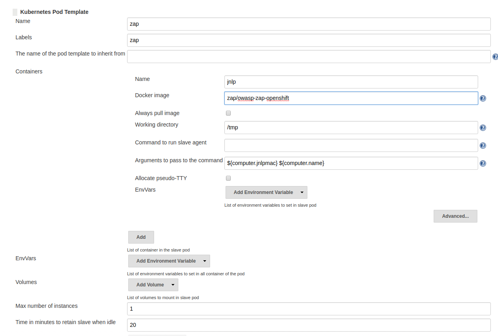

# OWASP [ZAP](https://github.com/zaproxy/zaproxy) Image For OpenShift

## Overview
The public docker registry version of OWASP's Zed Attack Proxy (ZAP) is not
compatible with OpenShift without using privleged containers. This
Docker image resolves that issue.

## Running

The semantics of running this are identical to the public OWASP ZAP docker
image, so look at the Wiki page [HERE](https://github.com/zaproxy/zaproxy/wiki/Docker).

## Deploying In OpenShift
```bash
oc new-build -l 'role=jenkins-slave' https://github.com/rht-labs/owasp-zap-openshift.git
```

## Configuring In OpenShift Jenkins
1. Log in to Jenkins with an account which has permissions to manage the Jenkins instance
1. Install the following plugins: 
   1. HTML Publisher Plugin
1. Restart Jenkins
1. Log back in to Jenkins and navigate to `Manage Jenkins -> Configure System`
1. Scroll down to the `Kubernetes` cloud configuration
1. Add a new "Pod Template" as shown below: 


## Using it in your Jenkinsfile
```groovy
node('zap') {
    stage('Get a ZAP Pod') {
        stage('Scan Web Application') {
            dir('/zap') {
                def retVal = sh returnStatus: true, script: '/zap/zap-baseline.py -r baseline.html -t http://<some-web-site>'
                publishHTML([allowMissing: false, alwaysLinkToLastBuild: false, keepAll: true, reportDir: '/zap/wrk', reportFiles: 'baseline.html', reportName: 'ZAP Baseline Scan', reportTitles: 'ZAP Baseline Scan'])
                echo "Return value is: ${retVal}"
            }
        }
    }
}
```
